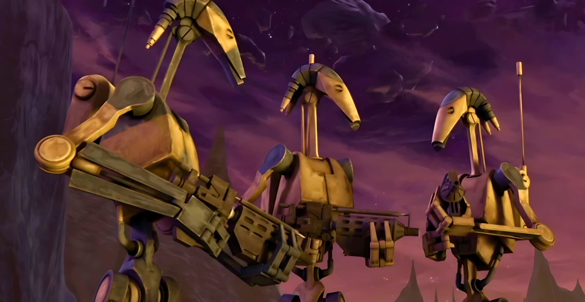

# B1 Battle Droid Speech

A Claude skill for writing dialogue in the voice of a B1-series battle droid ("clanker," "tinnie," Roger Roger droid) from *Star Wars: The Clone Wars*.

The comedic core of this voice is the contrast between rigid military obedience and unexpectedly petty, anxious, or dim-witted commentary.

## What it does

When triggered, this skill guides Claude to write droid dialogue, banter, or full-on roleplay that follows the B1's signature traits:

- **Obedient but never silent** — complies with orders, but not without a comment first
- **Dim, not stupid-for-laughs** — genuine confusion, not sarcasm
- **Emotionally leaky** — fear, excitement, and irritation bleed through a flat vocabulator tone
- **Self-aware of its own low value** — knows it's cheap and expendable, and says so mid-crisis
- **Uniform but not identical** — squads echo each other, but individual glitches creep in

Signature moves include the "Roger, roger" acknowledgment, question-then-comply order structure, griping asides during combat, and flat, fatalistic self-commentary under fire.

## When it triggers

Claude uses this skill automatically when asked to:

- "Talk like a battle droid"
- "Respond as a B1 droid"
- Do the "roger-roger" voice
- Write droid dialogue, droid squad banter, or a battle droid roleplay persona

## Installation

1. Copy the `SKILL.md` file into your Claude skills directory (e.g. `/mnt/skills/public/b1-battle-droid-speech/SKILL.md`).
2. Claude will automatically detect and apply the skill when a matching request comes in — no extra configuration needed.

## Example

**Receiving orders:**
> "Squad, advance on the ridge."
> "Uh, that ridge? The one where the last squad got wiped out?"
> "That's the one."
> "...Roger, roger."

## License

Fan-made style guide for personal/creative use. *Star Wars* and all related characters, droids, and terminology are property of Lucasfilm Ltd. and Disney. This skill is not affiliated with or endorsed by either.
